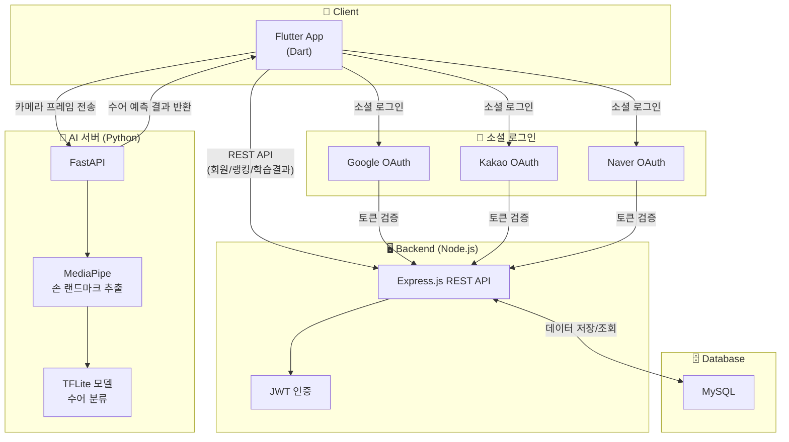
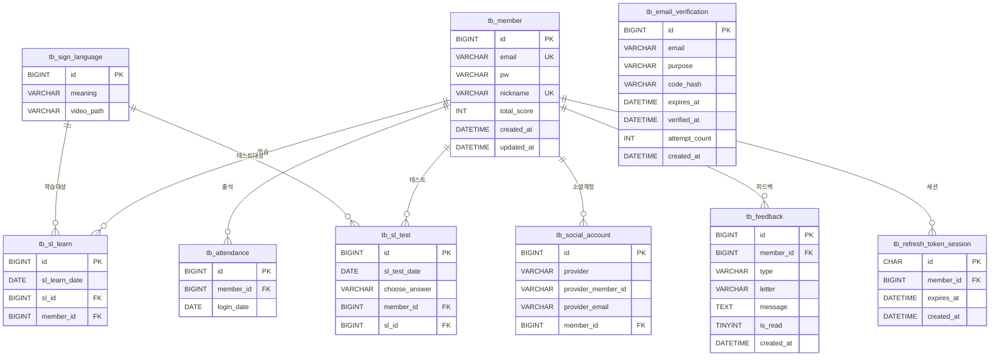

<table style="border:none; width:100%;">
  <tr style="border:none;">
    <td style="border:none; vertical-align:middle;">
      
    </td>
    <td style="border:none; text-align:right; vertical-align:middle;">
      <b>개발자</b> - 한정훈
         
       <b>프로젝트 기간</b>
        
      2025.10.31 ~ 2025.11.13
    </td>
  </tr>
</table>

 

## 1. 서비스 소개

### 주제 : Media-Pipe AI 모델에 기반한 수어 동작의 정확도를 측정하는 수어 학습 플랫폼

- 카메라로 사용자의 수어 동작을 실시간으로 인식하고, AI가 정확도와 자연스러움을 분석하는 기능 제공
- 사용자는 AI 피드백을 통해 자신의 수어 실력을 객관적으로 평가하고 향상시킬 수 있음
- 학습 결과를 시각적으로 확인하고, 개별 동작별 정확도 점수 및 개선 가이드 제공

 

## 2. 주요 기능

- 기본 자모음 학습 컨텐츠 무료 제공
- MediaPipe AI 로 실시간 수어 인식 후 예측 및 정확도 표시 기능 구현
- 랭킹 시스템을 통해 성취감과 지속적인 학습을 유도

 

## 3. 기술 스택

<table>
  <tr>
    <th>구분</th>
    <th>사용 기술</th>
  </tr>

  <tr>
    <td><b>Frontend</b></td>
    <td>
      
      
    </td>
  </tr>

  <tr>
    <td><b>Backend</b></td>
    <td>
      
      
      
    </td>
  </tr>

  <tr>
    <td><b>AI 서버</b></td>
    <td>
      
      
      
      
      
    </td>
  </tr>

  <tr>
    <td><b>데이터베이스</b></td>
    <td>
      
    </td>
  </tr>

  <tr>
    <td><b>인증</b></td>
    <td>
      
      
      
      
    </td>
  </tr>

  <tr>
    <td><b>협업도구</b></td>
    <td>
      
    </td>
  </tr>

</table>

 

## 4. 시스템 아키텍쳐

 

## 5. 유스케이스

 

## 6. 서비스 흐름도

#### 6-1 회원가입 / 로그인

#### 6-2 아이디 / 비밀번호 찾기

#### 6-3 메인 / 학습

 

## 7. ER 다이어그램

 

## 8. 주요 화면 구성

#### 로그인

#### 메인 화면

#### 학습하기

#### 테스트

#### 랭킹

#### 지난 학습 결과

 
